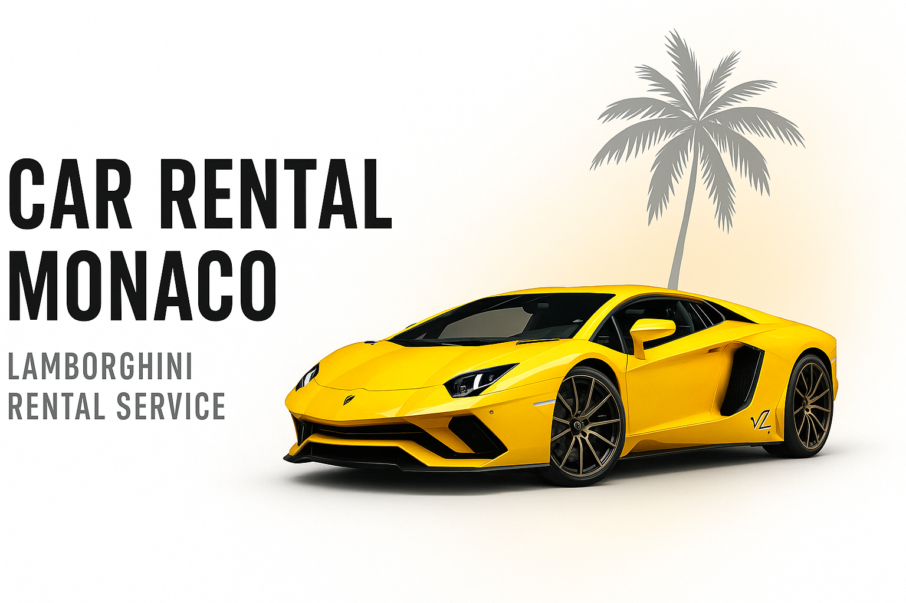

# Car Rental Monaco - Lamborghini Rental Service



A modern, responsive website for luxury Lamborghini car rentals in Monaco. This project features an interactive car catalog, booking forms, rental conditions, and contact information.

## Project Screenshots

### 1. Main Page


### 2. Rental Section


### 3. Fleet Carousel


### 4. Client Reviews


## Features

- **Interactive Custom Cursor** - Animated cursor with circular text on hover
- **Smooth Animations** - WOW.js animations throughout the page
- **Car Fleet Carousel** - Slick slider showcasing Lamborghini models
- **Client Reviews Slider** - Testimonials carousel with navigation
- **Parallax Effect** - Immersive scrolling experience
- **Booking Forms** - Two types of forms (callback & detailed booking)
- **AJAX Form Submission** - Asynchronous form handling with validation
- **Responsive Design** - Fully adaptive for all screen sizes
- **Smooth Scroll** - Anchor navigation with smooth scrolling
- **Back to Top Button** - Auto-appearing scroll-to-top functionality

## Technologies

| Category | Tools / Libraries |
|-----------|------------------|
| **Frontend** | HTML5, CSS3 (SCSS), Bootstrap 5 |
| **JavaScript** | jQuery, WOW.js, Animate.css, Slick Slider, Flatpickr, Parallax.js |
| **Utilities** | Gulp, jQuery Mask Plugin |
| **Icons** | Font Awesome |
| **Build Tools** | Node.js, npm, Gulp |


## Getting Started

1. Clone the repository:
  ```bash
  git clone https://github.com/your-username/car-rental-monaco.git
  cd car-rental-monaco

2. Install dependencies:
  ```bash
  npm install

3. Compile SCSS to CSS:
  ```bash
  gulp
